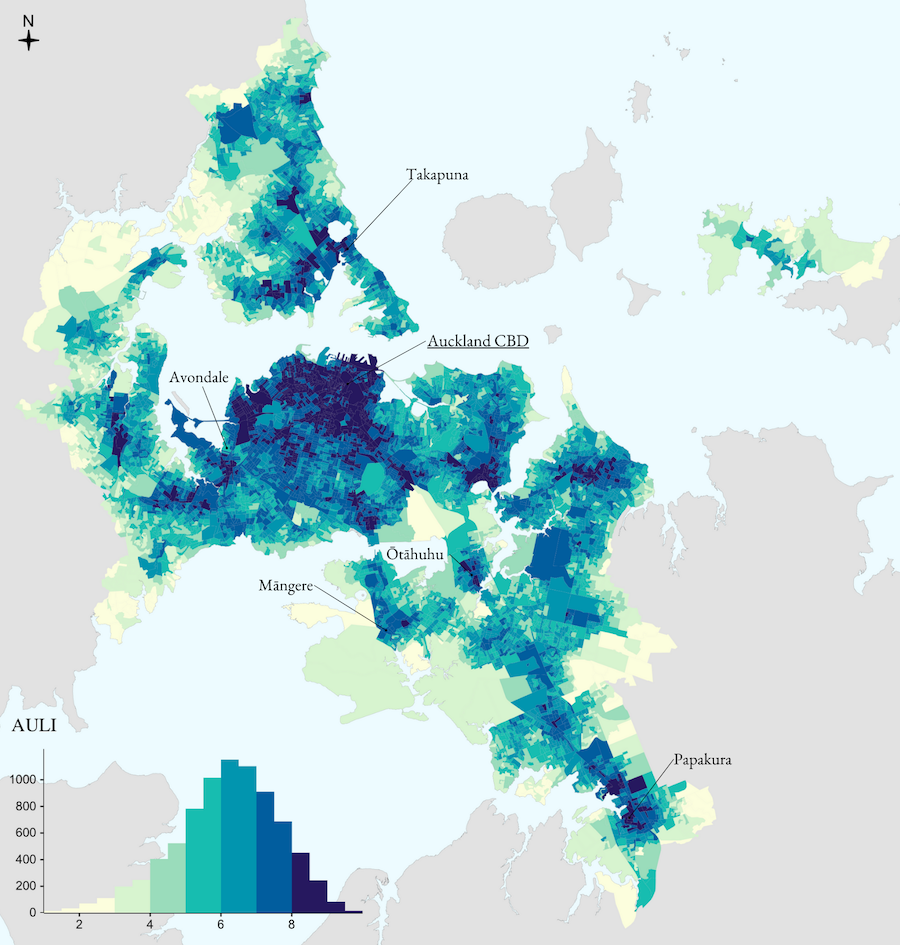

# The Auckland Urban Liveability Index (AULI) 🏙 🏡 🚈 🇳🇿

[](https://doi.org/10.1007/s12061-025-09456-8)

This repository contains the data and code used to create and analyze the Auckland Urban Liveability Index (AULI), a spatial composite indicator that quantifies modern liveability at the neighbourhood level in Auckland, New Zealand.

An interactive web map of the AULI and its components, created with Mapbox GL JS, can be accessed [here](https://jan.magnuszewski.com/auli).

### Main files descriptions

- [network_generation.ipynb](https://github.com/jankomag/uli-nz/blob/master/network_generation.ipynb) : python notebook to generate walking, biking and driving networks for the study area using the OSMnx package; getting bus freqency data from GTFS for Auckland transport

- [network_analysis.R](https://github.com/jankomag/uli-nz/blob/master/network-analysis.R): R script for calculating walking or driving distances to nearest of each of the amenities

- [data_prep.R](https://github.com/jankomag/uli-nz/blob/master/data_prep.R): gathering data for the index construction; dealing with missing values and cleaning the data

- [index.R](https://github.com/jankomag/uli-nz/blob/master/index.R): construction of the KULI, with data transformations, and saving the final index

- [regression_analysis.R](https://github.com/jankomag/uli-nz/blob/master/regression_analysis.R): contains various methods of evaluating the index, including spatial autocorrelation, regression analysis, GWR, and plotting and mapping the results

- The folder [web-map](https://github.com/jankomag/uli-nz/tree/master/web-map) contains the script for the web map

### Dataset

The final dataset of AULI and its components for Statistical Area 1 (2018) is available for download from this repository (AULI_SA1-2018.gpkg).

<p align="center">
  
</p>

### Publication

This work has been published in Applied Spatial Analysis and Policy:

> **The Auckland Urban Liveability Index: A Mechanism for Quantifying and Evaluating Modern Urban Densification**  
> Authors: Jan Magnuszewski, Roger Beecham, Luke Burns
> *Applied Spatial Analysis and Policy*, Volume 18, Article 43 (2025)  
> Published: 01 March 2025  
> Open Access: [https://doi.org/10.1007/s12061-025-09456-8](https://doi.org/10.1007/s12061-025-09456-8)

If you use this code or data in your research, please cite our paper:

```
@article{magnuszewski2025auckland,
  title={The Auckland Urban Liveability Index: A Mechanism for Quantifying and Evaluating Modern Urban Densification},
  author={Magnuszewski, Jan and Beecham, Roger and Burns, Luke},
  journal={Applied Spatial Analysis and Policy},
  volume={18},
  number={1},
  pages={1--28},
  year={2025},
  publisher={Springer}
}
```

## Abstract

We present the Auckland Urban Liveability Index (AULI), an indicator that quantifies modern liveability at neighbourhood-level in Auckland. The index comprises 29 variables spanning several components of liveability: social infrastructure, green space, transportation, safety and diversity. Each is documented transparently with accompanying data and code. We find that neighbourhoods with the highest liveability scores have comparatively good public transport provision and are amenable to active travel, and that residents from Pacific and Māori backgrounds disproportionately reside in neighbourhoods containing lower liveability scores. Through local modelling frameworks, we provide useful context on the generalisability of index components that supports transfer of our index to other cities in New Zealand and re-evaluation of our index in light of new data.
